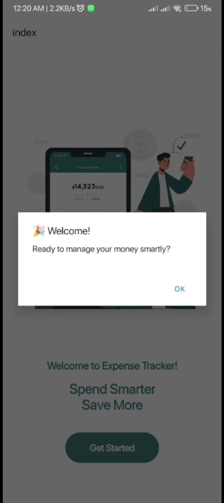
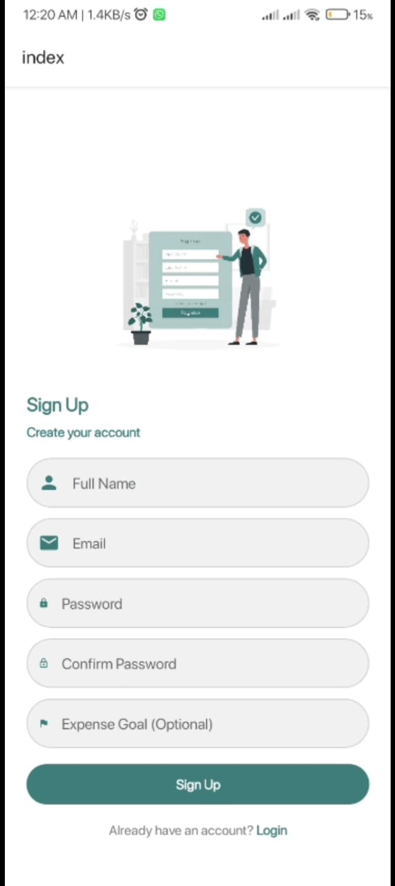
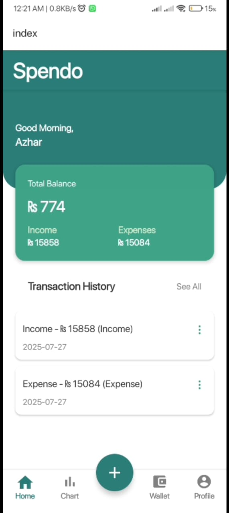

<<<<<<< HEAD
# Welcome to your Expo app 👋

This is an [Expo](https://expo.dev) project created with [`create-expo-app`](https://www.npmjs.com/package/create-expo-app).

## Get started

1. Install dependencies

   ```bash
   npm install
   ```

2. Start the app

   ```bash
   npx expo start
   ```

In the output, you'll find options to open the app in a

- [development build](https://docs.expo.dev/develop/development-builds/introduction/)
- [Android emulator](https://docs.expo.dev/workflow/android-studio-emulator/)
- [iOS simulator](https://docs.expo.dev/workflow/ios-simulator/)
- [Expo Go](https://expo.dev/go), a limited sandbox for trying out app development with Expo

You can start developing by editing the files inside the **app** directory. This project uses [file-based routing](https://docs.expo.dev/router/introduction).

## Get a fresh project

When you're ready, run:

```bash
npm run reset-project
```

This command will move the starter code to the **app-example** directory and create a blank **app** directory where you can start developing.

## Learn more

To learn more about developing your project with Expo, look at the following resources:

- [Expo documentation](https://docs.expo.dev/): Learn fundamentals, or go into advanced topics with our [guides](https://docs.expo.dev/guides).
- [Learn Expo tutorial](https://docs.expo.dev/tutorial/introduction/): Follow a step-by-step tutorial where you'll create a project that runs on Android, iOS, and the web.

## Join the community

Join our community of developers creating universal apps.

- [Expo on GitHub](https://github.com/expo/expo): View our open source platform and contribute.
- [Discord community](https://chat.expo.dev): Chat with Expo users and ask questions.
=======
# Spendo - Expense Tracker App 

**Spendo** is a simple and intuitive expense tracking app built using **React Native**. It helps users keep track of their income and expenses, categorize transactions, and visualize spending habits.

---

##  Project Objective

To develop a mobile application for personal finance management that allows users to:
- Add, edit, and delete income/expense transactions
- View total balance, income, and expenses
- Filter transactions by type or date
- View visual charts for financial analysis
- You can also connect your Cards or any Bank account to it and made and receive payments directly in the app

---

## Technologies Used

- React Native (Expo)
- JavaScript (ES6+)
- Context API for global state management
- AsyncStorage for local data storage
- React Navigation
- Victory Native (for charts)

---

## Screenshots


*Landing Page*


*Event detail screen with register option*


*Successful addition of Income and Expense in account*

---

## How to Run the Project

### Prerequisites:
- Node.js & npm installed
- Expo CLI installed (`npm install -g expo-cli`)

### Steps:
1. Clone the repository:
   ```bash
   git clone https://github.com/ZoyaKhalid/Spendo.git
   cd Spendo
2. Install  dependencies:
   ```bash
   npm install
3. Run the App:
   ```bash
   expo start
>>>>>>> 1c3e7ba1e687bd06f245747c5fc719d32b252068
